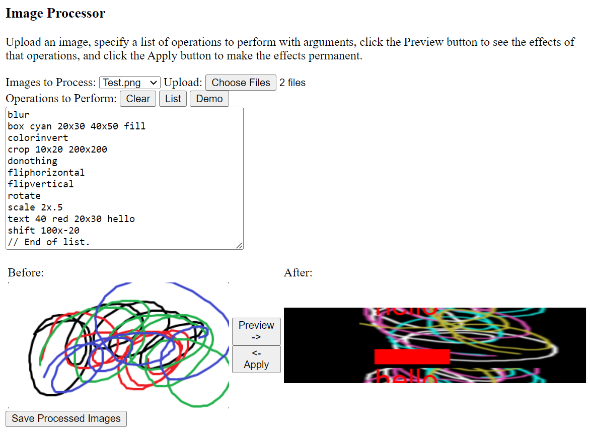

ImageProcessor
==============

The code in this repository, when run, will allow the user to upload an image, and then run operations on it to modify it.

It is intended to eventually expand the functionality of this application to allow multiple operations to be performed on multiple images simultaneously.

